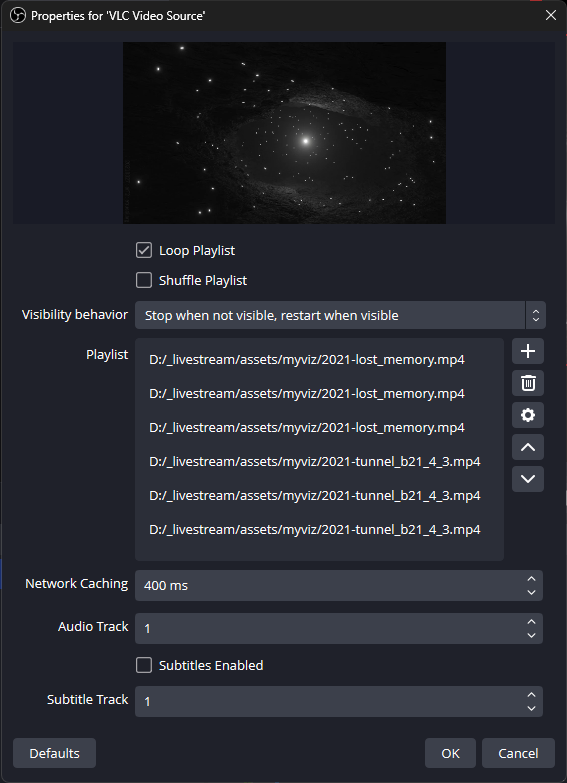
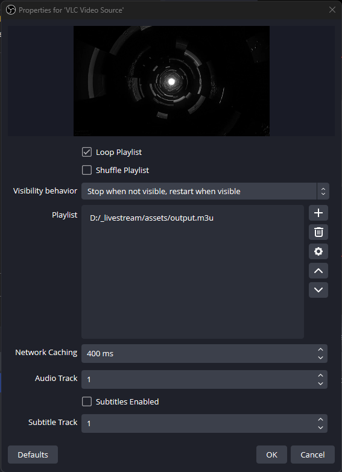

# loopextender

Create [m3u](https://en.wikipedia.org/wiki/M3U) playlist files for [OBS](https://github.com/obsproject/obs-studio) [VLC Video Source](https://obsproject.com/kb/media-sources#vlc-video).

Find a [demo video on YouTube](https://www.youtube.com/watch?v=6pYTthir_qs).

---

## Dependencies

- [Python](https://python.org) >= 3.9.2

---

## Usage

```bash
loopextender.py [-h] [-c] [-o] [-s] infile outfile
```

```text
positional arguments:
  infile           absolute or relative input file path
  outfile          absolute or relative output file path

optional arguments:
  -h, --help       show this help message and exit
  -c, --check      check file paths from the input file for their existence
  -o, --overwrite  do not ask for confirmation to overwrite if the output file already exists
  -s, --shuffle    shuffle the output order
```

---

## Motivation

I got some short loop videos with a duration of 10 seconds each. To let them run for longer than 10 seconds, lets say 30 seconds, I have to add the same file 3 times in a row. The order will also be the same every time unless I reorder the playlist manually. This is all cumbersome.



Now, to make it easier, I just create a text file and define the videos and their repetitions there, like so:

```text
# input.txt

3,d:\_livestream\assets\myviz\2021-lost_memory.mp4
3,d:\_livestream\assets\myviz\2021-tunnel_b21_4_3.mp4
```

Then I just have to feed this input to **loopextender** and it will create a playlist file.

```text
# output.m3u

d:\_livestream\assets\myviz\2021-lost_memory.mp4
d:\_livestream\assets\myviz\2021-lost_memory.mp4
d:\_livestream\assets\myviz\2021-lost_memory.mp4
d:\_livestream\assets\myviz\2021-tunnel_b21_4_3.mp4
d:\_livestream\assets\myviz\2021-tunnel_b21_4_3.mp4
d:\_livestream\assets\myviz\2021-tunnel_b21_4_3.mp4
```



---
